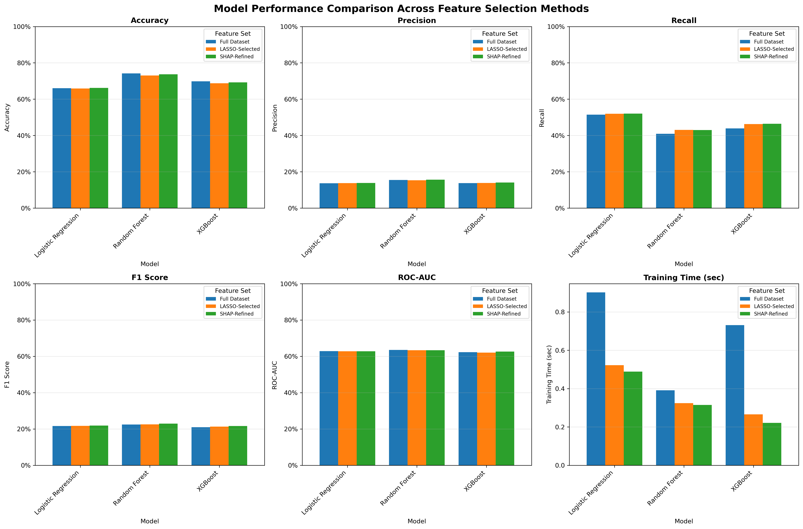
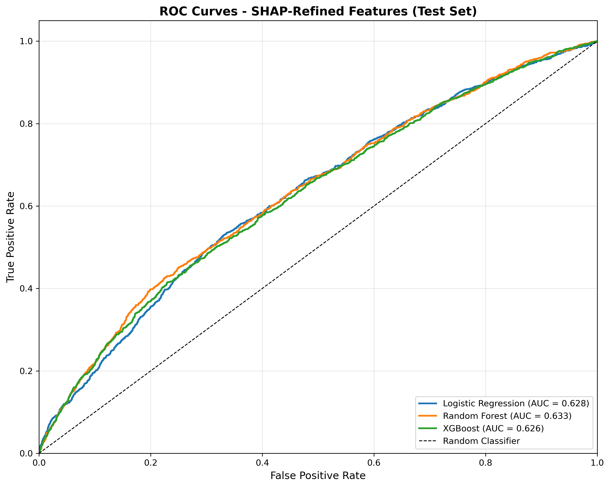

# Predicting Readmission Rate for Diabetic Patients Using Machine Learning

**DS 207 Final Project**

**Team Members:**
- Colin Frishberg (cpfrish@berkeley.edu)
- Terra Jiang (yjiang66@berkeley.edu)
- Sai Sriya Mudigonda (smudigonda@berkeley.edu)
- Rahil Sharma (rahilsharma@berkeley.edu)

---

##  Project Overview

This project implements machine learning models to predict hospital readmission for diabetic patients. Our workflow is divided into four main Jupyter Notebooks (.ipynb), each managed by a team member.

---

### Directory Structure

```
. 
├── data/ 
│ ├── .gitkeep
│ ├── README.md
│ ├── feature_selection_info.json
├── notebooks/ 
│ ├── README.md 
│ ├── colin_dp.ipynb 
│ ├── colin_viz_transformer.ipynb 
│ ├── rahil_dp_baseline.ipynb 
│ ├── sriya_eda_comparison.ipynb 
│ ├── terra_tf_rf_xgb.ipynb 
├── results/ 
│ ├── baseline.pkl 
│ ├── box_plots_combined.html
│ ├── feature_selection_summary.json
│ ├── kde_plots_combined.html
│ ├── terra_final_report_tables.pdf
│ ├── terra_rf.pkl 
│ ├── terra_stats_tf_rf_xgb.csv
│ ├── terra_tf.pkl
│ ├── terra_xgb.pkl 
│ ├── test.csv 
│ ├── train.csv 
│ ├── transformer.h5 
│ ├── val.csv 
│ ├── violin_plots_combined.html
├── .DS_Store
├── .gitignore
├── final_project_milestone.pdf
├── final_project_proposal.pdf
├── final_project_report.pdf
├── final_project_slides.pdf
└── requirements.txt
```

---

## Contribution Distribution & Workflow

The project is structured so that each notebook's "Run All" execution follows a logical step in the overall methodology.

### 1-a. Rahil: Data Processing & Logistic Baseline

**`notebooks/rahil_dp_baseline.ipynb`**

* **Primary Responsibility:** **Data Preparation** and establishing the **Baseline Performance**.
* **Workflow:**
    1.  Perform initial data cleaning and pre-processing.
    2.  Split the dataset into **Train, Validation, and Test** sets.
    3.  **Output:** Save the processed data splits to `/results/` as `train.csv`, `val.csv`, and `test.csv`.
    4.  Build, train, and evaluate the **Logistic Regression Baseline Model**.
    5.  **Output:** Save the trained baseline model to `/results/baseline.pkl`.

### 1-b. Colin: Alternative Data Processing

**`notebooks/colin_dp.ipynb`**

* **Primary Responsibility:** Alternative **Data Preparation**.
* **Workflow:**
    1.  Perform initial data cleaning and pre-processing.
    2.  Split the dataset into **Train, Validation, and Test** sets.
    3.  **Output:** Save the processed data splits to `/data` (not pushed to the repo).

### 2. Sriya: EDA & Feature Analysis

**`notebooks/sriya_eda_comparison.ipynb`**

* **Primary Responsibility:** **Exploratory Data Analysis (EDA)** and **Model Comparisons**.
* **Workflow:**
    1.  **Input:** Load processed data splits from `/results/train.csv` and `/results/test.csv`.
    2.  Perform **EDA** to understand the output distributions and key statistics.
    3.  Perform **Feature Importance Analysis** across all trained models (Logistic Baseline, Transformer, Random Forest, XGBoost).

### 3. Colin: Visualization & Transformer Model

**`notebooks/colin_viz_transformer.ipynb`**

* **Primary Responsibility:** **Data Visualization** and developing the **Transformer Model**.
* **Workflow:**
    1.  Create compelling **data visualizations**.
    2.  **Input:** Load processed data splits (train, val, and test) from `/results`.
    3.  Build, train, and evaluate the **Transformer Model**.
    4.  **Output:** Save the trained Transformer model to `/results/transformer.h5`.
    5.  **Output:** Save the kde plot to `/results/kde_plots_combined.html`.
    6.  **Output:** Save the box plot to `/results/box_plots_combined.html`.
    7.  **Output:** Save the violin plot to `/results/violin_plots_combined.html`.

### 4. Terra: Random Forest & XGBoost Models

**`notebooks/terra_tf_rf_xgb.ipynb`**

* **Primary Responsibility:** Developing and tuning 3 models - **Logistic Regression**, **Random Forest**, and **XGBoost**.
* **Workflow:**
    1.  **Input:** Load processed data splits (train, val, and test) from `/results`.
    2.  Build, **tune**, and evaluate the **Logistic Regression (LR) Model**.
    3.  **Output:** Save the trained LR model to `/results/terra_tf.pkl`.
    4.  Build, **tune**, and evaluate the **Random Forest (RF) Model**.
    5.  **Output:** Save the trained RF model to `/results/terra_rf.pkl`.
    6.  Build, **tune**, and evaluate the **XGBoost (XGB) Model**.
    7.  **Output:** Save the trained XGB model to `/results/terra_xgb.pkl`.
    8.  **Output:** Save the statistics from the 3 models to `/results/terra_stats_tf_rf_xgb.csv`.

---

## Execution Order

For a full project run, please execute the notebooks in the following order:

1.  **`rahil_dp_baseline.ipynb`** (Creates data splits and baseline model)
2.  **`colin_dp.ipynb`** (Creates different data processing methods for the transformer model)
3.  **`colin_viz_transformer.ipynb`** (Needs data splits from both dp outputs)
4.  **`terra_rf_xgb.ipynb`** (Needs data splits)
5.  **`sriya_eda_comparison.ipynb`** (Needs data splits and all trained models)
## Results

Class imbalance made raw accuracy misleading (near-zero F1 at deceptively high accuracy), so training data was rebalanced (SMOTE/oversampling to ~51/49) and **F1 drove model selection**.

| Model | Test F1 | Test accuracy | Notes |
|---|---|---|---|
| **XGBoost** | **57.91%** | **56.47%** | Best overall; selected model |
| Random forest | 57.56% | 56.31% | Competitive but overfit |
| Logistic regression | lower | — | Baseline |
| Tabular transformer | lowest | — | Underperformed on tabular data |

Subgroup check on the selected model: F1 59.81% (female) vs. 55.76% (male). SHAP was used to explain the drivers; see the figures below and the full discussion (including why absolute scores are modest — label noise, 1999–2008 temporal boundary) in [`final_project_report.pdf`](final_project_report.pdf).



